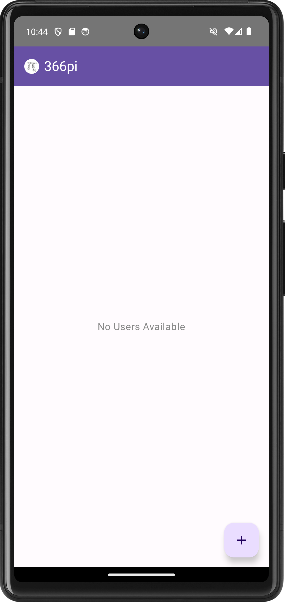
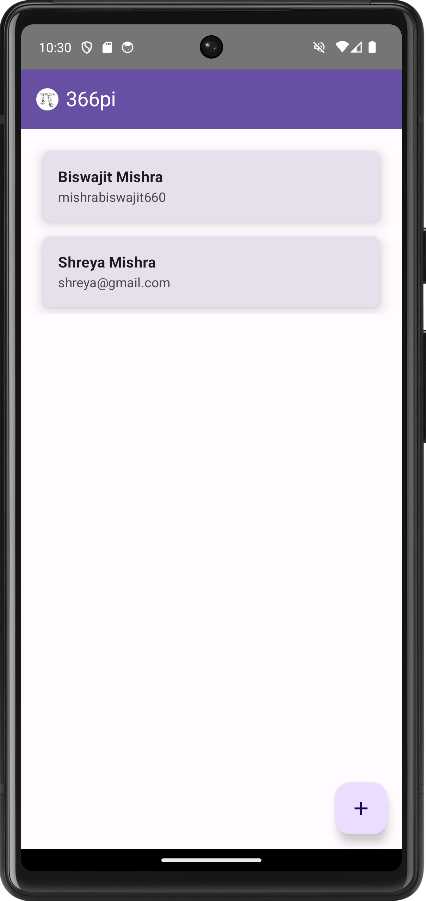
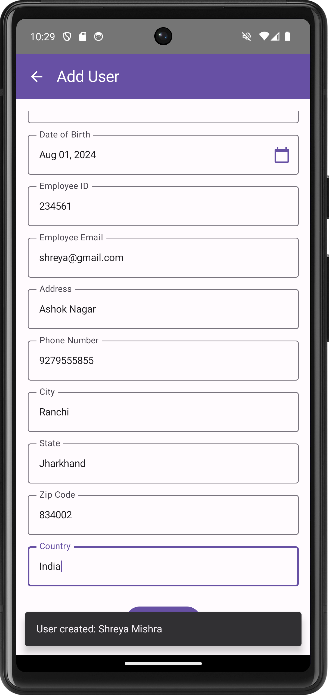
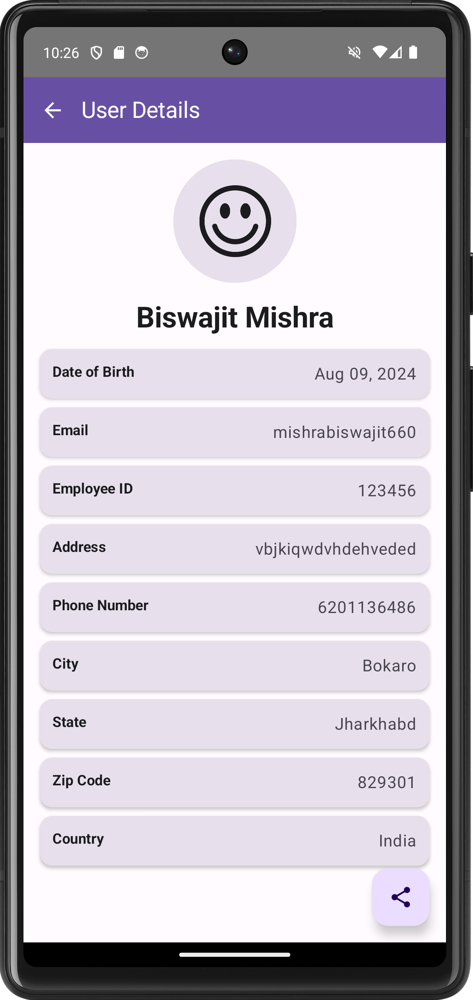
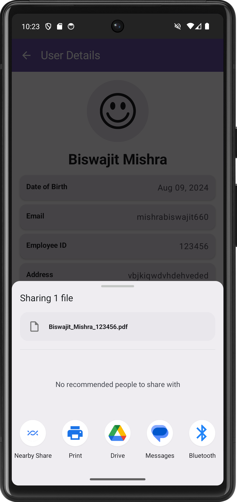

# Employee Management App

This Android app allows you to manage employee details such as personal information, contact details, and more. The app is built using Kotlin and Jetpack Compose, with a focus on modern UI and architecture practices.

## Features

- **Add New Employee**: Enter details like first name, last name, date of birth, email, employee ID, address, phone number, city, state, zip code, and country.
- **View Employee Details**: Displays detailed information of the employee, including their date of birth and contact details.
- **Generate PDF**: Export employee details to a PDF and share it directly from the app.
- **Input Validation**: Ensures that the entered data adheres to specific formats (e.g., names contain only letters, phone numbers contain only digits).
- **Date Picker**: Select the employee's date of birth using a custom-styled DatePicker.
- **Material 3 Design**: Utilizes the latest Material 3 components and styling for a modern look and feel.

## Screens

<div style="display: flex; flex-wrap: wrap; gap: 10px;">










<div>

### 1. Add User Page
- **Top App Bar**: Displays the title "Add User" with a back navigation icon.
- **Input Fields**: Collects employee information such as:
  - First Name
  - Last Name
  - Date of Birth
  - Employee ID
  - Email
  - Address
  - Phone Number
  - City
  - State
  - Zip Code
  - Country
- **Date Picker Dialog**: Allows users to pick a date of birth with a custom-styled calendar.
- **Add User Button**: Validates input and creates a new user record.

### 2. User Detail Page
- **Top App Bar**: Displays the title "User Details" with a back navigation icon.
- **User Information**: Shows detailed information about the employee, including:
  - Full Name
  - Date of Birth
  - Email
  - Employee ID
  - Address
  - Phone Number
  - City, State, Zip Code, Country
- **Floating Action Button**: Exports user details to a PDF and shares it.
- **Profile Picture**: Displays a placeholder profile picture (to be updated with actual image functionality).

## Technology Stack

- **Kotlin**: Programming language used to build the app.
- **Jetpack Compose**: Modern toolkit for building native Android UI.
- **Material 3**: For consistent, modern, and responsive design.
- **ViewModel**: For managing UI-related data in a lifecycle-conscious way.
- **Coroutines**: For asynchronous programming.
- **Room Database (Optional)**: Can be integrated for storing user data locally (not included in this version).
- **Retrofit (Optional)**: Can be integrated for interacting with web APIs (not included in this version).

## Installation

1. **Clone the repository:**
   ```bash
   git clone https://github.com/mishrabiswajit/Employee-management-app.git
   cd Employee-management-app
   ```

2. **Open in Android Studio:**
   - Open the project in Android Studio.
   - Sync the project with Gradle files.

3. **Build and Run:**
   - Build the project and run it on an emulator or physical device.

## Usage

1. **Add a New User**: Fill in all the required fields on the Add User page and press "Add User".
2. **View User Details**: Navigate to the User Detail page to see the full details of an employee.
3. **Export and Share**: Generate a PDF of the user details and share it using the floating action button.

## Contributing

Contributions are welcome! Please fork this repository and submit pull requests for new features, bug fixes, or improvements.

## License

This project is licensed under the MIT License. See the [LICENSE](LICENSE) file for more details.

## Acknowledgements

- **Icons**: Used from the Material Icons library.
- **Jetpack Compose**: For providing an intuitive and declarative UI toolkit.